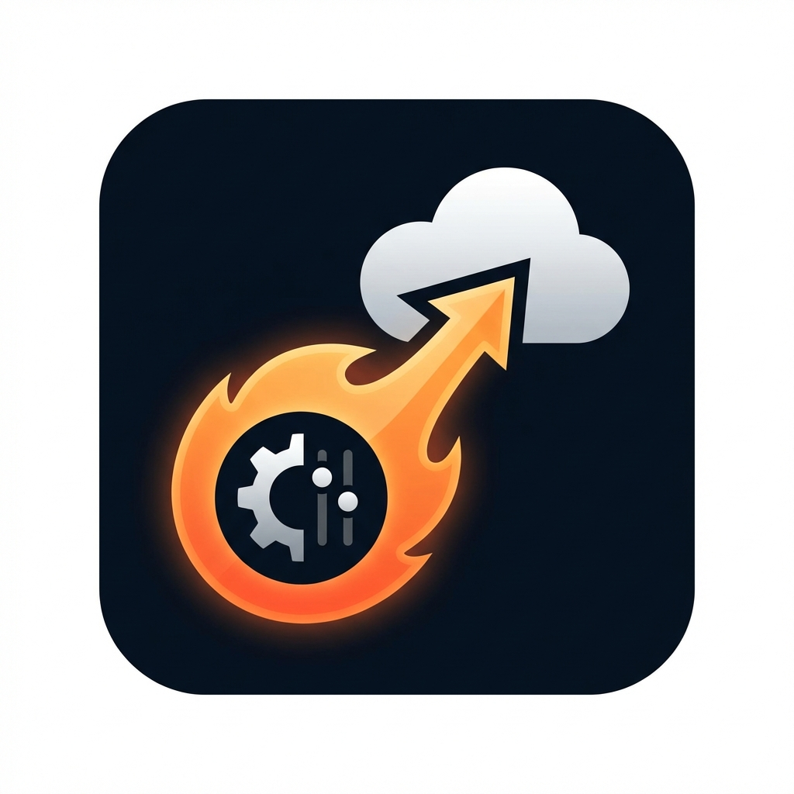

# Firebase Remote Config Push

Push data to **Firebase Remote Config** directly from VS Code. Designed for developers who want a faster, integrated way to manage their remote parameters without leaving their editor.

## 🚀 Features

- **Direct Push**: Update Remote Config parameters instantly from VS Code.
- **Smart Validation**:
    - **Key Check**: Prevents invalid key formats (e.g., no hyphens allow, only alphanumeric and underscores).
    - **Type Support**: Locally validates **JSON**, **Number**, **Boolean**, and **String** before pushing.
- **Interactive UI**: A simple, modern webview form for quick data entry.
- **Project Awareness**: Displays the active Firebase Project ID in the UI to prevent accidental pushes to the wrong environment.
- **Safe Merging**: Automatically fetches the current template and merges your changes—**never** overwrites your entire configuration.
- **Workspace Isolation**: Save your service account path per workspace for secure, project-specific workflows.

## 🛠️ Getting Started

1. **Service Account**: Obtain a Firebase Service Account JSON file with "Remote Config Admin" permissions.
2. **Setup**: Run the command `Push to Firebase Remote Config` from the Command Palette (`Ctrl+Shift+P` / `Cmd+Shift+P`).
3. **Configure**: The first time you run it, you'll be prompted to select your `.json` service account file.
4. **Push**: Fill in the Key, Value, and Type, and hit **Push Config**!

## ⚙️ Extension Settings

This extension contributes the following settings:

* `rmcPush.serviceAccountPath`: Path to your Firebase service account JSON file (Best kept in your local `.vscode` folder and gitignored).

## 🛡️ Best Practices

- Always **gitignore** your service account JSON files.
- Use the `Reset Service Account Path` command if you need to switch credentials for a workspace.

---

**Built with ❤️ for Flutter & Mobile Developers.**
