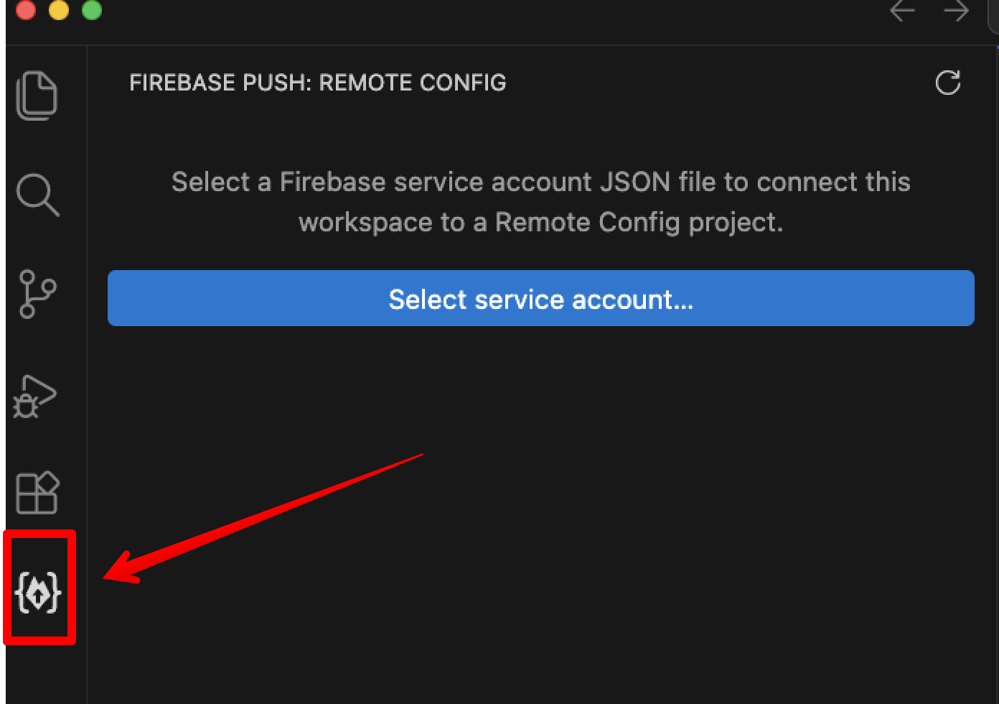
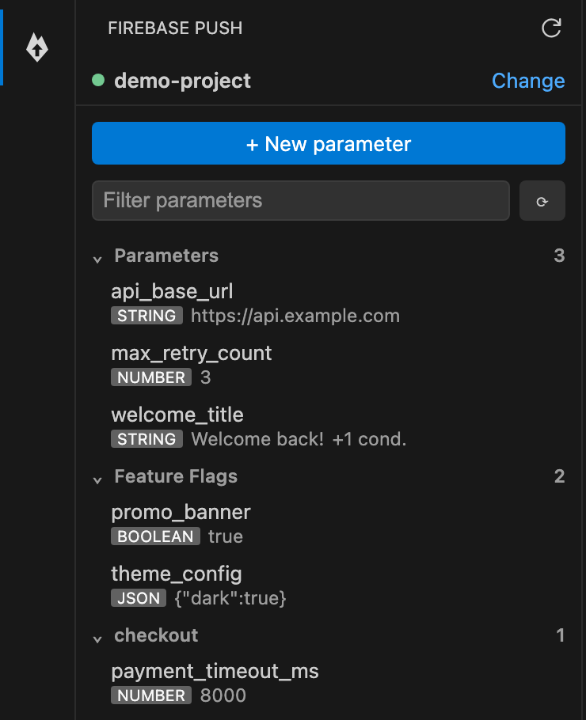
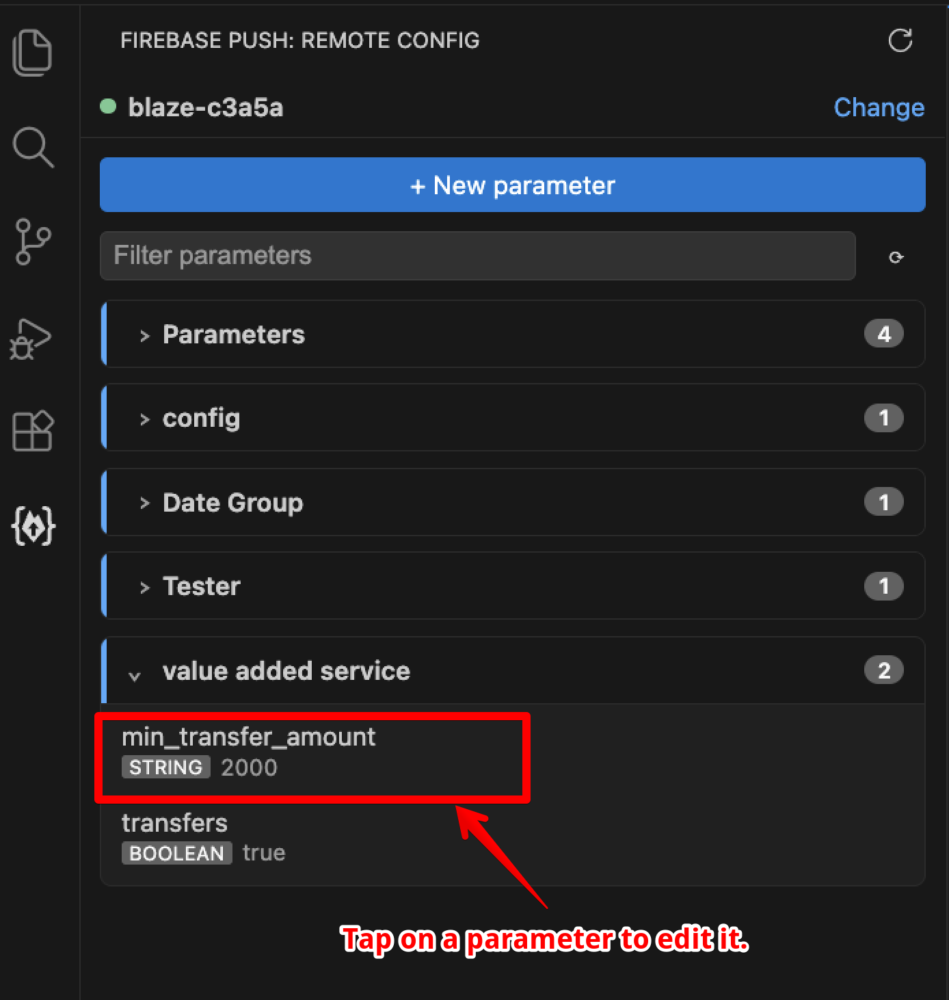
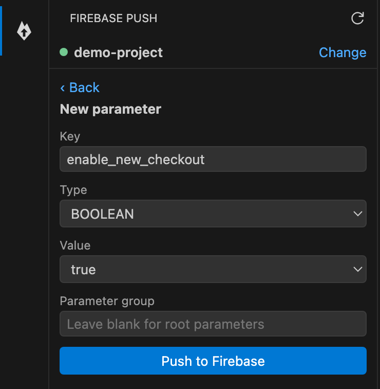

# Firebase Remote Config Push (VS Code)

Browse and edit **Firebase Remote Config** directly from **VS Code**—no Firebase Console needed.

The extension lives in its own sidebar, like a source-control or test-explorer view: open it once and your project's parameters are right there, ready to edit.

This extension is built for developers who want a **fast, safe, and simple** way to manage Remote Config while staying inside their editor.


---

## 🚀 Features

- **Dedicated Sidebar**: Its own icon in the activity bar—no command needed to get back to it.
- **Browse Your Config**: Lists every existing parameter and parameter group, with type and current value at a glance. Filter by key to find things fast.
- **Click to Edit**: Select any parameter to open it pre-filled, change the value, and save.
- **Direct Push**: Create new parameters, in the root or in any group.
- **Smart Validation**:
  - **Key Check**: Prevents invalid key formats (e.g., no hyphens allowed, only alphanumeric and underscores).
  - **Type Support**: Validates **JSON**, **Number**, **Boolean**, and **String** before pushing—in the panel for instant feedback, and again before anything reaches Firebase.
- **Native Look**: Uses your VS Code colour theme, light, dark, or high-contrast.
- **Project Awareness**: Displays the active Firebase Project ID at the top of the panel to prevent accidental pushes to the wrong environment.
- **Safe Merging**: Automatically fetches the current template and merges your changes—**never** overwrites your entire configuration.
- **Workspace Isolation**: Save your service account path per workspace for secure, project-specific workflows.

---

## ✅ Supported Value Types

- **String**
- **Number**
- **Boolean**
- **JSON**

---

## 📦 Requirements

Before using this extension, make sure you have:

- A **Firebase project**
- A **Firebase Service Account JSON file**
- The service account must have **Remote Config Admin** permissions

---

## 🛠️ Step-by-Step Setup & Configuration

### Step 1: Create a Firebase Service Account

1. Go to **Firebase Console**
2. Open your project
3. Navigate to:
   ```
   Project Settings → Service Accounts
   ```
4. Click **Generate new private key**
5. Download the `.json` file

> ⚠️ **Important:**  
> Never commit this file to Git.

---

### Step 2: Connect Your Project

1. Open **VS Code**
2. Click the **Firebase Push** icon in the activity bar (the left-hand strip)
3. Click **Select service account…** and choose the `.json` file you downloaded



✅ The path is saved **per workspace**, so you only do this once.

Prefer the keyboard? Open the **Command Palette** (`Cmd + Shift + P` on macOS, `Ctrl + Shift + P` on Windows/Linux) and run **RMC Push: Select Service Account**.

---

### Step 3: Edit an Existing Value

1. The sidebar lists your parameters, grouped exactly as they are in Firebase
2. Click any parameter to open it
3. Change the **Value** (and **Type** if needed) and click **Save to Firebase**



*Every parameter and group, with its type and current value. Use the filter box to narrow a long list.*



*Clicking a row opens it pre-filled, ready to change and save.*

> Keys cannot be renamed from here—renaming would create a duplicate rather than moving the original. Create a new parameter instead.

---

### Step 4: Create a New Value

1. Click **+ New parameter** at the top of the sidebar
2. Fill in the form:
   - **Key** → e.g. `enable_new_checkout`
   - **Type** → Boolean / String / Number / JSON
   - **Value** → `true`
   - **Parameter group** → leave blank for root parameters
3. Click **Push to Firebase** 🎉



The extension will:

- Fetch the existing Remote Config
- Merge your change safely
- Push only the updated values

---

## ⚙️ Extension Settings

This extension adds one setting:

```json
rmcPush.serviceAccountPath
```

**What it does**

- Stores the path to your Firebase service account
- Saved per workspace
- Recommended location: `.vscode/`

---

## 🔄 Switching Firebase Projects

Click **Change** next to the project name at the top of the sidebar, and pick a different service account file.

Or open the Command Palette and run **RMC Push: Reset Service Account Path** to disconnect entirely.

---

## ⌨️ Commands

All commands are available from the Command Palette under the **RMC Push** category:

| Command | What it does |
| --- | --- |
| **Push to Firebase Remote Config** | Opens and focuses the sidebar |
| **Select Service Account** | Picks the service account JSON file |
| **Reset Service Account Path** | Disconnects the current service account |
| **Reload Remote Config** | Re-fetches the template from Firebase |

---

## 🛡️ Best Practices

- ✅ Always `.gitignore` service account files
- ✅ Use separate service accounts for staging & production
- ❌ Never share service account keys publicly
- 🔍 Double-check the **Project ID** shown before pushing

> ⚠️ **There is no dry-run.** Every push writes to the live Remote Config template of the connected project and takes effect for real clients immediately. Point the extension at a staging project while you are getting familiar with it.

---

## ❤️ Who This Is For

- Mobile developers
- Flutter engineers
- Backend engineers
- Anyone tired of opening Firebase Console just to change a flag

---

**Built with ❤️ for Flutter & Mobile Developers**
